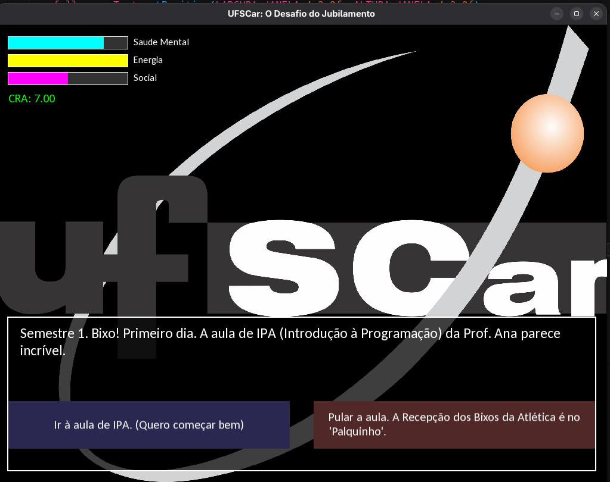
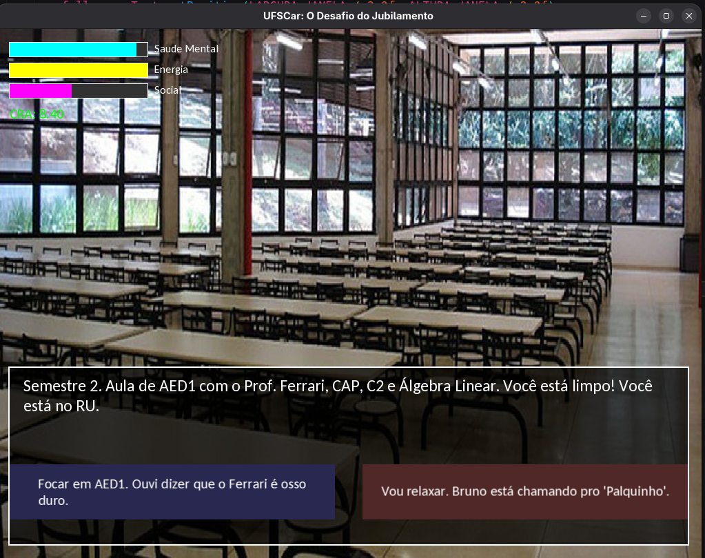
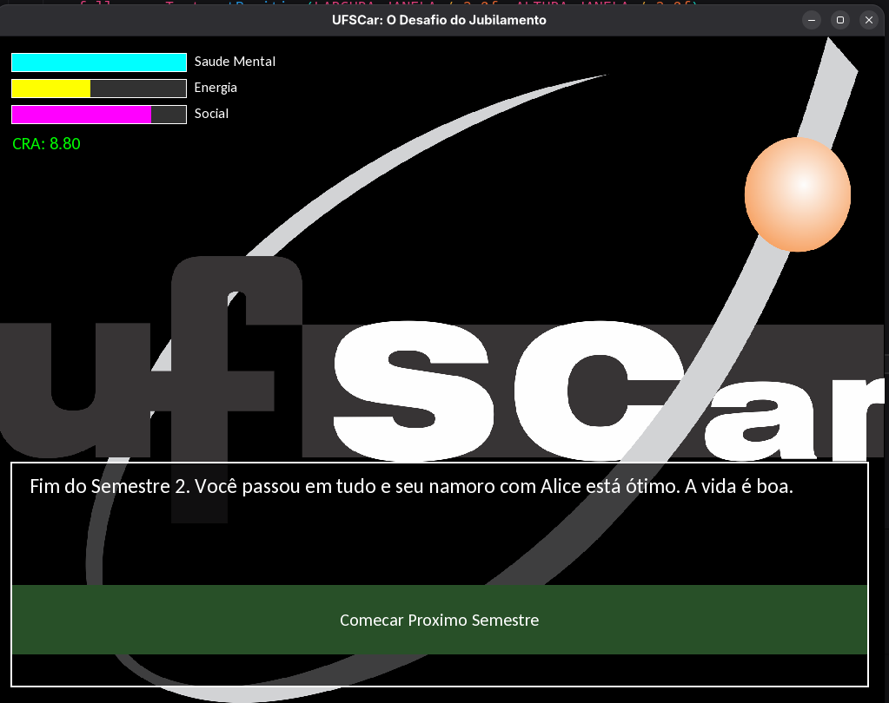

# UFSCar: O Desafio do Jubilamento
Um simulador de vida universitária em C++ com a biblioteca SFML, focado na jornada de um aluno de Ciência da Computação na UFSCar.



## 📝 Descrição

Este projeto é um jogo narrativo no estilo "Visual Novel" que simula os desafios, decisões e consequências da vida de um estudante de Ciência da Computação (BCC) na Universidade Federal de São Carlos (UFSCar).

Cada escolha afeta os atributos principais do jogador — **Saúde Mental**, **Energia**, **Social** e **CRA** — e o conduz por uma árvore de decisões complexa com múltiplos finais, desde a formatura com honras até o temido jubilamento.

### Contexto Acadêmico

Este jogo foi desenvolvido como projeto para a disciplina de **Algoritmos e Estruturas de Dados 1 (AED1)**. O requisito técnico central era a implementação e uso de uma **Árvore Binária**. Neste projeto, a árvore binária é a estrutura de dados fundamental que armazena toda a narrativa, onde cada nó (`Evento`) representa uma situação e suas duas "filhas" (`proximoEventoEsq`, `proximoEventoDir`) representam as duas escolhas possíveis.

## ✨ Funcionalidades

* **História Ramificada:** Uma narrativa complexa com dezenas de eventos e múltiplos finais baseados nas suas escolhas.
* **Simulação de Status:** Gerencie 4 atributos que impactam diretamente o desenrolar da história.
* **Narrativa Realista:** A história utiliza matérias reais do currículo do BCC-UFSCar (IPA, GA, Cálculo 1, AED1 com Prof. Ferrari, AOC, POO), locais (RU, BCo, DC, ATs, Palquinho) e eventos (Trote, TUSCA).
* **UI Dinâmica:** A interface gráfica foi construída com SFML e inclui quebra de linha automática (`wrapText`) para os diálogos e botões de escolha dinâmicos.

## 🛠️ Tecnologias Utilizadas

* **C++** (`-std=c++11`)
* **SFML 2.5+** (Biblioteca gráfica para janelas, sprites, texto e eventos)
* **Makefile** (Para automação da compilação)

## 🚀 Como Compilar e Rodar

**Pré-requisitos:**
* Um compilador C++ (g++)
* A biblioteca `make`
* As bibliotecas do SFML (`-lsfml-graphics`, `-lsfml-window`, `-lsfml-system`)

**Passos:**

1.  Clone este repositório:
    ```bash
    git clone [[https://github.com/renan-michelao/BCC-UFSCar-RPG.git](https://github.com/renan-michelao/BCC-UFSCar-RPG.git)
    cd BCC-UFSCar-RPG](https://github.com/renan-michelao/Vida-Universitaria-RPG.git)
    ```

2.  Compile o projeto usando o Makefile:
    ```bash
    make
    ```

3.  Execute o jogo:
    ```bash
    ./ufscar_rpg
    ```

4.  Para limpar os arquivos compilados:
    ```bash
    make clean
    ```

## 👥 Autores

| Nome | RA |
| :--- | :--- |
| Renan Cavalcanti Michelão | 845578 |
| Miguel Leal Landi | 847792 |
| Mateus Alves da Silva Dias | 847942 |
| Gabriel Ribeiro Almeida do Carmo | 845242 |




